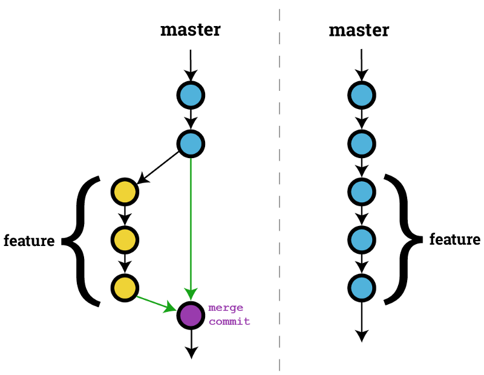

--- 
# Getting started
1. Register for an account on github.com
2. Download, install and configure git
3. Configure Git in your terminal

But first ...

---
# Work with SSH keys

1. Make sure Git Bash is installed
2. Create an SSH key pair (`ssh-keygen`)
3. Register public key (`~/ssh/id_rsa.pub`) on Github

<https://help.github.com/articles/adding-a-new-ssh-key-to-your-github-account/>

---

### Work with SSH keys

Follow the link and execute

<https://help.github.com/articles/adding-a-new-ssh-key-to-your-github-account/>

---

### Git basic configuration


```console
git config --global --edit
```


---
### Check if everything is correct

```console
git config --list
```

---
### `git status`  ftw!

- current state
- next step
- step back

---
# What is git

---
# What is git - basics?


* Git is a tool that tracks your progress based on time


---


### Git takes snapshots


- You can take snapshots to return your steps
- You can also share these snapshots with others


---
### A *repository* manages the history of your project

* Each project must have its own repository

--> So no Angular and Android project on the same repo

---
### Create a repo


- Create a repo on Github, initialize with README
- Clone with SSH:

```console
git clone git@github.com:user/repo.git
```


---

### `git` is your desk

1. **Working directory**: where you work and write
2. **Staging area**: a draft ready to review
3. **Repository**: final version, ready for archiving

---


### Simple workflow (solo)
#### Create file and add it to staging

```
touch readme.md
git status
git add reamdme.md

```


---

### Simple workflow (solo)
#### Make Commit
```console
$ git commit -m "Adjustment Description"
```


---
### How to write a `git commit` Message


---
### How to write a `git commit` Message

1. Separate subject from body with a blank line
2. Limit the subject line to 50 characters
3. Start with a capital letter for the subject
4. Do not end the subject line with a dot
5. Use the imperative in the subject line
6. Max body characters: 72
7. Use the body to explain what and why and how (if necessary)

---

Commit messages with a body are not easy to write with the -m option. It is better to write the message in a text editor.

[Customize Git configuration.](https://git-scm.com/book/en/v2/Customizing-Git-Git-Configuration)

---
### Tips and tricks <sup> 1 </sup>

Use your favorite editor (eg TextMate):

```console
git config --global core.editor "mate -w"
```

Other editors: [example](https://help.github.com/articles/associating-text-editors-with-git/)

---
### Tips and tricks <sup> 2 </sup>
Use a git commit template to ensure that everyone uses the correct structure.

```bash
git config --global commit.template ~/.gitmessage.txt
git commit
```

---
###Tips and tricks <sup> 3 </sup>
```bash
# [<tag>] (If applied, this commit will ...) <subject> (Max 72 char)
# | <---- Preferably using up to 50 chars ---> | <-------------------> |
# Example:
# [feat] Implement automated commit messages

# (Optional) Explain why this change is being made
# | <---- Try To Limit Each Line To A Maximum Of 72 Characters ----> |

# (Optional) Provide links or keys to any relevant tickets, articles or other resources
# Example: Github issue # 23

# --- COMMIT END ---
# Tag can be
# feat (new feature)
# fix (bug fix)
# refactor (refactoring code)
# style (formatting, missing semi-colons, etc; no code change)
# doc (changes to documentation)
# test (adding or refactoring tests; no production code change)
# version (bump version / new release; no production code change)
# jsrXXX (Patches related to the implementation of jsrXXX, where XXX the JSR number)
# jdkX (Patches related to supporting jdkX as the host VM, where X the JDK version)
# dbg (Changes in debugging code / frameworks; no production code change)
# license (Edits regarding licensing; no production code change)
# hack (Temporary fix to make things move forward; please avoid it)
# WIP (Work In Progress; for intermediate commits to keep patches reasonably sized)
# defaults (changes default options)
#
# Note: Multiple tags can be combined, e.g. [fix] [jsr292] Fix issue X with methodhandles
# --------------------
# Remember to:
# * Capitalize the subject line
# * Use the imperative mood in the subject line
# * Do not end the subject line with a period
# * Separate subject from body with a blank line
# * Use the body to explain what and why vs.. how
# * Can use multiple lines with "-" or "*" for bullet points in body
# --------------------
```

---
### Use "git status" after every step

- modified / added files: <span style = "color: red"> red </span>
- files in "staging": <span style = "color: green"> green <span>


* info about the command for the next step
* info about the command to undo step

---
### Comparing workplaces

```bash
git diff
```

- Show changes between commits, commit and working tree, etc

--- 
### Comparing workplaces
```bash
git diff --staged
```

- Compares staging with the repository directory
- No output if these are the same
---
### Commits must be arranged logically

-  **1 commit for each feature!**
- What if you do a rollback that contains two features, but you only have to change one of them
- The second feature is then also rolled back.

---
### Commits must be arranged logically
There is a problem with the "git add". command. Because we are currently working in the root folder, "git add" will only add files that are in the root directory. But the root directory can contain many other folders with files. How can we add files from those other folders, plus the files in the root directory to the collection area? Git offers the following command:

```console
$ git add -A
```

---

## Ctrl-Z!<sup>1</sup>

A fun metaphor is to think of Git as a timeline management utility. Commits are snapshots of a point in time or points of interest along the timeline of a project's history. Additionally, multiple timelines can be managed through the use of branches. When 'undoing' in Git, you are usually moving back in time, or to another timeline where mistakes didn't happen.


---

```
git-checkout
``` 
- Switch branches or restore working tree files

---

Using the git checkout command we can check out the previous commit using the commit's name, putting the repository in a state before the last commit. Checking out a specific commit will put the repo in a "detached HEAD" state. This means you are no longer working on any branch. In an independent state, any new commits you make will be orphaned when you change branches back to an established branch.

---

Orphaned commits are up for deletion by Git's garbage collector. The garbage collector runs on a configured interval and permanently destroys orphaned commits. To prevent orphaned commits from being garbage collected, we need to ensure we are on a branch.

---

From the detached HEAD state, we can execute 

```bash
git checkout -b new_branch
```

This will create a new branch named new_branch and switch to that state. The repo is now on a new history timeline in which the last commit no longer exists.

---

## Ctrl-Z!<sup>2</sup>

```
git-revert
``` 

-Revert some existing commits

Let's assume we have an original commit history example.  This time let's try a revert 'undo'. If we execute 
```console
git revert HEAD
```
Git will create a new commit with the inverse of the last commit. This adds a new commit to the current branch history.

---
## Ctrl-Z!<sup>3</sup>
```
git-reset
```
-Reset current HEAD to the specified state

If we invoke 
```
git reset --hard a1e8fb5
``` 
the commit history is reset to that specified commit. Previous commits no longer exist in the commit history. At this point, we can continue working and creating new commits as if the new commits never happened. This method of undoing changes has the cleanest effect on history.)

---
## Ctrl-Z!<sup>4</sup>

```
git commit --amend
```

Once you have made more changes in the working directory and staged them for commit by using `git add`, you can execute `git commit --amend`. This will have Git open the configured system editor and let you modify the last commit message. The new changes will be added to the amended commit.

---
## Ctrl-Z!<sup>5</sup>
The 
```
git clean
``` 
The command is a convenient utility for undoing changes to the working directory.

---
## History
```
git log
```

```console
commit 318f763a52c7987eedb3e27f38e47d6c8f5f7762
Author: eothein <jens.buysse@gmail.com>
Date: Fri Feb 15 10:14:21 2019 +0100

    [feat] Add tips and tricks for commit messages

    https://gist.github.com/zakkak/7e06725ebd1336bfebebe254de3de825
    https://help.github.com/articles/associating-text-editors-with-git/
```

---

### Pro tip: Aliases

Add to `~/.bashrc`:

```
alias s = 'git status'
alias a = 'git add'
alias c = "git commit -m"
alias d = "git diff"
alias g = "git"
aka h = 'git log --pretty = "format:% C (yellow)% h% C (blue)% ad% C (reset)% s% C (red)% d% C (green)% an% C (reset),% C (cyan)% ar "--date = short --graph --all '
alias p = "git push && git push - tags"
aka gp = 'git pull --rebase'
alias pr = 'git pull --rebase'
aka pt = 'git push -u origin --tags'
# Git author stats
alias gs = 'git ls-tree -r -z --name-only HEAD | xargs -0 -n1 git blame --line-porcelain | grep "^ author" | sort | uniq -c | sort -nr '

```

---
### Quiz
What do the following commands do

* ```git config --global user.the name" Sam Smith "```
* ```git init```
* ```git add <filename>```
* ```git commit -m" Commit message "```
* ```git push origin master```
* ```git status```
* ```git diff```
* ```git checkout - <filename>```


---
### Exercise: Make your repo

- Create your repo
- Configure as needed
- Adjust the readme.md file
- Commit the changes
- Make some adjustments to the readme file, and commit them
- Also, make some adjustments and cancel them in the staging, working tree

---
### Ex: Learn and practise git

<https://gitexercises.fracz.com/>

---
# Branches
---


* "Master" is the standard branch, it is a naming convention.
* You can view a branch as a bookmark for commits.
As we add commits, the active branch points to the new commit





---

### Branches in the terminal

- Branches are pointers to commits
```
git show master
``` 
shows the commit to which the master refers
```
git branch
``` 
shows the branches in your project with ` * ` the current branch

---
### Create a new branch

```
git branch newBranch
``` 
create a branch" newBranch "
- Branches refer back to the current active commit

```
git checkout branchName
```
puts your working directory on that branch

<http://git-school.github.io/visualizing-git/>

---
### Pull means = fetch + merge

- Pull first gets the commits and hits them up locally.
- Merges them and places them together in the staging and creates a new commit with two parents.
- Merging updates the active branch to point of the new merge commit
- You see the new commits reflected in your local project when you execute "git log".

---

### Exercise

1. Create a repository on your desktop called 'planets' with a
readme.md and commit it.
2. Choose a Wikipedia page about a planet of your choice.
3. Copy the first paragraph over the planet, paste it in your
readme.md and commit it.
4. Create a new branch (`git branch <branchname>`) and switch to it (`git
<branchname> checkout).

---

5. Add a Wikipedia entry about another planet
in the readme.
6. Save, then commit, then exit.
7. Does the file show your first planet? Or the second?
8. What happens if you go back to the master branch?
---
# Working in a team

---

## Give others access to your repository

* Right click on **Settings**
* In the menu on the left, click on **Collaborators**
* Add the usernames of those who should have access

---

## Setting up a project on GitHub

* One person does the following:
    * Create a new repository
    * Option to create README + `.gitignore`
    * Add team members
* Everyone does
    * `git clone https://github.com/USER/PROJECT.git`

---

## Workflow: working in a team

* Get the latest revision: `git pull origin master`
* Make changes: `git add`,` git commit`
* To central repository: `git push origin master`
* `-u` is short for` --set-upstream '


---
## Exercise

- Add people to your repository
- Add files to each other's repo
- What goes wrong and how do we solve it?

# Teamwork

---

## Trunk-based development

- No branches on central repo!
- Applied with Continuous Integration / Delivery / Deployment
- Feature flags

---

### Feature branches

- Software with discrete releases
- Master is always "clean"
- More complex!
- Possible bottlenecks


---
### Main branches
* master: product-worthy
* develop: latest changes for the next release

---
### Supporting branches

* feature
* branches off from develop
* contain new features of the software
````git checkout -b myfeature develop`

```
git checkout develop
Switched to 'develop' branch
git merge --no-ff myfeature
Updating ea1b82a..05e9557
(Summary of changes)
git branch -d myfeature
Deleted branch myfeature (was 05e9557).
git push origin developer
```


### --no-ff

---

### Release and hotfix

release
* branches off from develop or master
* preparation for new production release
* `git checkout -b release-1.2 developer`


---

```
git checkout master
Switched to branch 'master'
git merge --no-ff release-1.2
Merge made by recursive.
(Summary of changes)
git tag -a 1.2
git checkout develop
Switched to 'develop' branch
git merge --no-ff release-1.2
Merge made by recursive.
(Summary of changes)
git branch -d release-1.2
```

---

### Pull requests

- For employees who do not have write access
- More complex to set up
- Always commit on the topic branch
- Synchronize with "upstream"